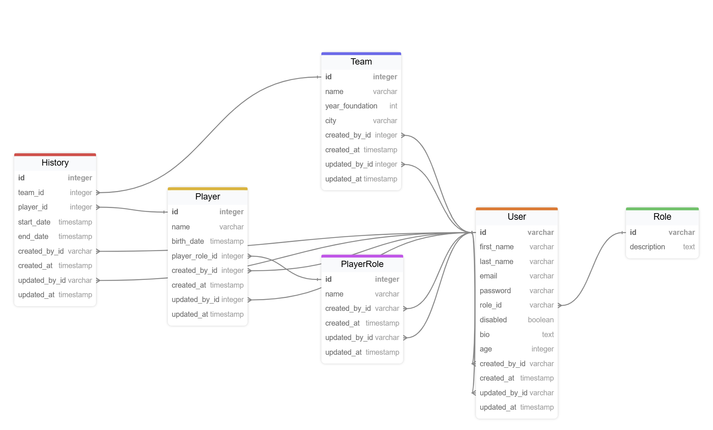

# FA (Football Archive)

Main considerations:

- There are two different roles: admin, user.
- Admin users can create, read, update, delete all the players, teams, history and player roles.
- Standard users:
  - can create players, teams and player_roles;
  - can create history only of own players and teams
  - can read, update and delete only own players, teams, history and player roles.
