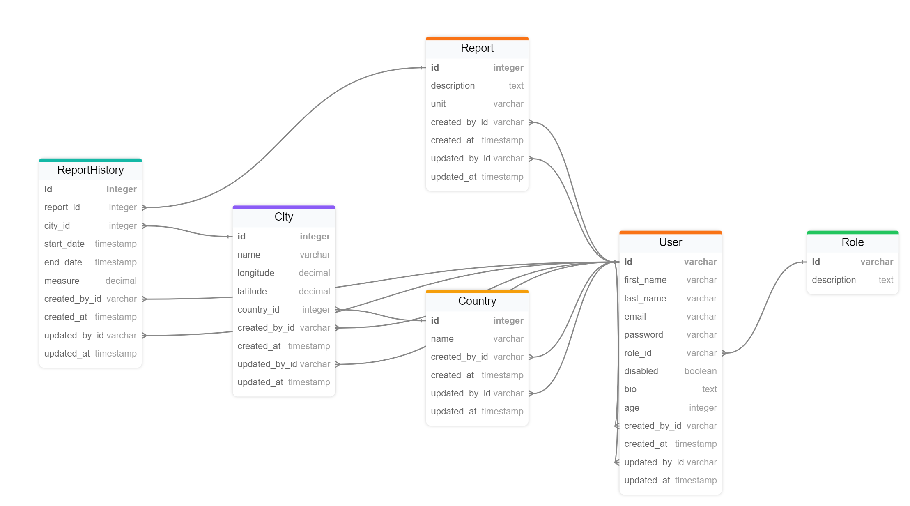

# WR (Weather Report)

Main considerations:

- There are two different roles: admin, user.
- Admin users can create, read, update, delete all the cities, countries, reports and report histories.
- Standard users:
  - can create cities, countries and reports;
  - can create report histories only of own cities  and reports;
  - can read all the coutries but can update and deleted only own ones;
  - can read, update and delete only own cities, countries, reports and report histories.
