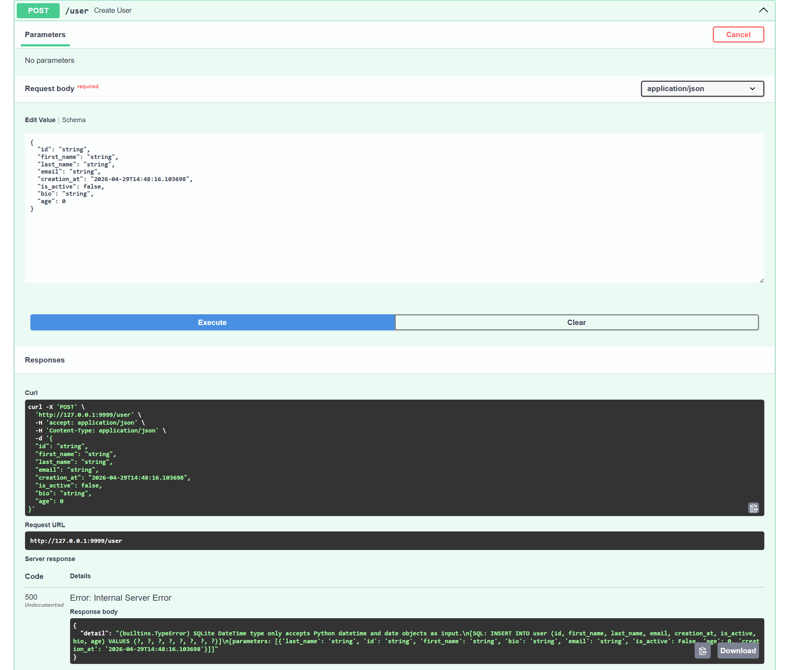
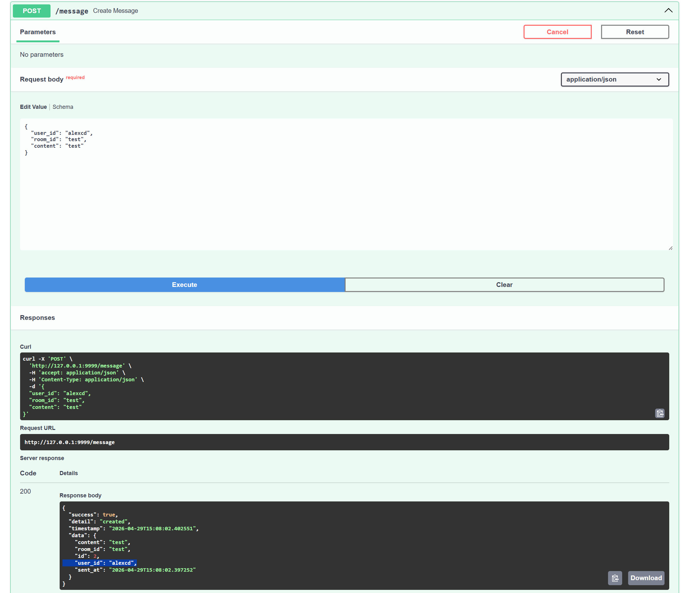

# Exercises

## User creation_at Bug

When you try to set the value of the creation_at there is the error in the figure.

How to avoid this problem?

Possibile solutions:

- Use a different model for User Creation instead of Uses to avoid the possibility to set creation_at
- Convert the format of the input from string to datetime.

Note: same considerations are valid for Room and "sent_at" when you create a new message.

## User Email Format not Checked

When you create a new user with a not valid email there is not check and the user is created.

How to avoid this problem?

Possible solution: implement some check before to insert the new user.

## User not active Join Room

When not active user join to a room there is no check.

Possible solution: implement some check before to create the new relationship.

## User (and Room) not Checked when Sending Message

When you a user join to a room there are the checks about the existence of the user and the room.

The same approach is missing when a user send a message to a room.

How to avoid this problem?

Possible solution: Use the check in join and leave endpoints in the creation of a message.
